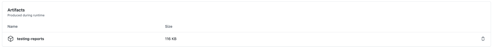

# api-automation-solution-reto-qa

Este es un proyecto de Automatización que utiliza Serenity BDD y Rest Assured
para la creación de un framework de automatización que permita probar la
API [RESTFUL - BOOKER](https://restful-booker.herokuapp.com/apidoc/index.html)

Este proyecto ha sido desarrollado por [Camila Dimas](https://www.linkedin.com/in/camiladimas/) para mejorar el
desarrollo en pruebas avanzadas de api automation.
***

## 🏠 Detalles del Tester

* Name: `Camila Dimas`
* Country: `Colombia`
* City: `Bogotá`
* LinkedIn: [https://www.linkedin.com/in/camiladimas/](https://www.linkedin.com/in/camiladimas/)

***

## 🛠️ Lenguajes & Frameworks

Este proyecto utiliza los siguientes lenguajes y frameworks:

* [Serenity BDD](https://serenity-bdd.github.io/theserenitybook/latest/index.html) como framework de pruebas
  automatizadas.
* [Rest Assured](https://cucumber.io/) como framework para probar y validar servicios REST en Java.
* [Cucumber](https://cucumber.io/) como software de testing BDD que permite elaborar pruebas a partir de AC.

* [Gson](https://github.com/google/gson) como una biblioteca para convertir objetos Java a JSON (serialización) y JSON a
  objetos Java (deserialización)
* [Jayway JsonPath](https://github.com/json-path/JsonPath) como forma estandarizada para consultar elementos de un
  objeto JSON por medio de expresiones.

* [Java 17](https://www.oracle.com/co/java/technologies/javase/jdk11-archive-downloads.html) como lenguaje de
  programación.
* [Screen Play](https://serenity-js.org/handbook/thinking-in-serenity-js/screenplay-pattern.html) como el patrón de
  diseño.
* [Gradle](https://gradle.org/) como herramienta de compilación.

***

## 🟢 Pre-requisitos: 🟢

1. Descargar la última versión estable de Java
   JDK [aquí](https://www.oracle.com/co/java/technologies/javase/jdk11-archive-downloads.html)
2. Instalar git desde [aquí](https://git-scm.com)
3. Instalar Gradle Buil Tool desde [aquí](https://gradle.org/install/)

**🗒️ Nota**: `build.gradle` tiene toda la configuración del proyecto instalada, ejecutar el siguiente comando para
iniciar todas las tareas (Incluidos los test).

👀 Adicional en su **IDE** de preferencia deberá tener instalados los siguientes plugins:

1. [x] *JUnit*
2. [x] *Cucumber for Java*
3. [x] *Gherkin*
4. [x] *Lombok*

***

### 🚀 Pruebas de Integración continua

> Con GitHub Actions, puedes crear flujos de trabajo de integración continua (IC) directamente en tu repositorio de
> GitHub.

Para este proyecto se hace uso de GitHUb Actions como herramienta para la integración continua del framework de
automatización desarrollado.

La ruta del pipeline se encuentra en: `.github/workflows/automated-testing-integration.yml`

| develop                    | status                                                                                                                                                                                                                                                                                                 |
|----------------------------|--------------------------------------------------------------------------------------------------------------------------------------------------------------------------------------------------------------------------------------------------------------------------------------------------------|
| **Pruebas de integración** | [](https://github.com/CAMIDIMAS18/api-automation-solution-reto-qa/actions/workflows/automated-testing-integration.yml) |

**⏱️ Ejecución automatizada**:   
El pipepile se ejecutará periódicamente de forma automática por medio la siguiente 'cron schedule expression':

```yml
on:
schedule:
  - cron: "00 13 * * TUE"
```

**📄️ Generando los reportes de prueba**:  
Con la ejecución del pipepile se generará un artefacto `testing-reports` donde se alojarán los reportes con los
resultados de esa ejecución realizada.


***

### 🧪 Casos de prueba contemplados

Test diseñados para validar los escenarios **Happy Paths** 😃

> **✨ FEATURE**: Booking | Confirmar funcionamiento de la api
> - [x] [YP-001] Confirmar si la api está en funcionamiento
>
> **✨ FEATURE**: Booking | Generar token de autenticación
> - [x] [YP-002] Validar la creación de token de autenticación
>
> **✨ FEATURE**: Booking | Crear una reserva
> - [x] [YP-003] Validar la creación de una nueva reserva
>
> **✨ FEATURE**: Booking | Consultar una reserva
> - [x] [YP-004] Validar que se pueda consultar una reserva por su BookingId
> - [x] [YP-005] Validar que se puedan consultar todas las reservas existentes
> - [x] [YP-006] Validar que se pueda consultar una reserva por los nombres del cliente
> - [x] [YP-007] Validar que se pueda consultar una reserva por un rango de fechas específicas
> - [x] [YP-008] Ver todos los ID's de las reservas consultando por fechas específicas
>
> **✨ FEATURE**: Booking | Actualizar una reserva
> - [x] [YP-009] Validar la actualización de una reserva actual
> - [x] [YP-010] Validar la actualización parcial una reserva actual
>
> **✨ FEATURE**: Booking | Eliminar una reserva
> - [x] [YP-011] Validar la eliminación de una reserva actual
***
Test diseñados para validar los escenarios **UNHappy Paths** 🤡

> **✨ FEATURE**: UnHappy Paths | Validar que no se puedan crear/consultar/actualizar/eliminar reservas
> - [x] [YP-012] Validar que no se pueda crear un reserva al no enviar un campo obligatorio
> - [x] [YP-013] Validar que no se pueda consultar una reserva eliminada
> - [x] [YP-014] Validar que no se pueda actualizar una reserva eliminada
> - [x] [YP-015] Validar que no se pueda eliminar una reserva sin estar autenticado
***

## 🏗️ Estructura del proyecto

El proyecto tiene scripts de compilación para Gradle y sigue la estructura la siguiente estructura basada en el patrón
de diseño de Screenplay:

```Gherkin
src
+ main                                  | Source main
+ test                                  |
+ java                                | Test runners and supporting code
+ org.api.testing.demo                | Package base
+ assertions                        | Assertions of the test
+ interactions                      | Simple interaction class for REST requests.
+ model                             | DTOs, Pojos, Builders, etc ...
+ questions                         | Different types of test validation questions
+ runners                           | Responsible for executing feature scenario
+ steps                             | Sets of test steps
+ {feature_name}                  | Feature name
+ booking                       | Utility class for definition steps
+ hooks                         | Definition of Hooks
+ tasks                             | High-level actions that define a set of actor interactions
+ utils                             | General utility class
+ resources                           |
+ features                          | Feature files+ {booking}                      | Feature folder specific
{feature_name}.feature
       | Feature name+ {unHappyPaths}                | Feature folder specific
{feature_name}.feature
       | Feature name
+ serenity.conf                     | Config file for Serenity
+ logback-test.xml                  | Config logs file
+ serenity.properties               | General properties Serenity
```

***

## ▶️ Ejecución del proyecto:

1. Descarga el proyecto desde GitHub
    * **Opción 1** (HTTPS): `https://github.com/CAMIDIMAS18/api-automation-solution-reto-qa.git`
    * **Opción 2** (SSH): `git@github.com:CAMIDIMAS18/api-automation-solution-reto-qa.git`
    * **Opción 3:** Descárgalo como archivo Zip y extráelo

***

2. **CD** en la carpeta `api-automation-solution-reto-qa > serenity-restful-booker-reto`.
3. Configurar Gradle
    * Ejecute el siguiente comando en el terminal:`./gradlew build`.

***

4. Ejecutar las pruebas en el proyecto
    * **Opción 1**: ejecutar `./gradlew clean test aggregate` en la ruta del proyecto o puede hacerlo por medio de este
      comando:

    ```bash
    gradle clean test --no-build-cache -Denvironment=dev -Dcucumber.filter.tags="@integrationTest"
    ```

* **Opción 2**: Ir a las clases de la carpeta **runners** `src/test/java/org/api/testing/demo/runners` y ejecutar
  cada Runner.

***

## 📄 Generación de informes

El informe al detalle con los pasos y resultados de las pruebas que se registrará en la ruta:
`target/site/serenity/index.html`.

Adicional se genera un reporte single page si se desea una revisión de alto nivel sobre los resultados de los test, el
cual se registrará en la ruta:
`target/site/serenity/serenity-summary.html`.

Este comando permitirá generar ambos reportes:

```bash
./gradlew reports
```

***